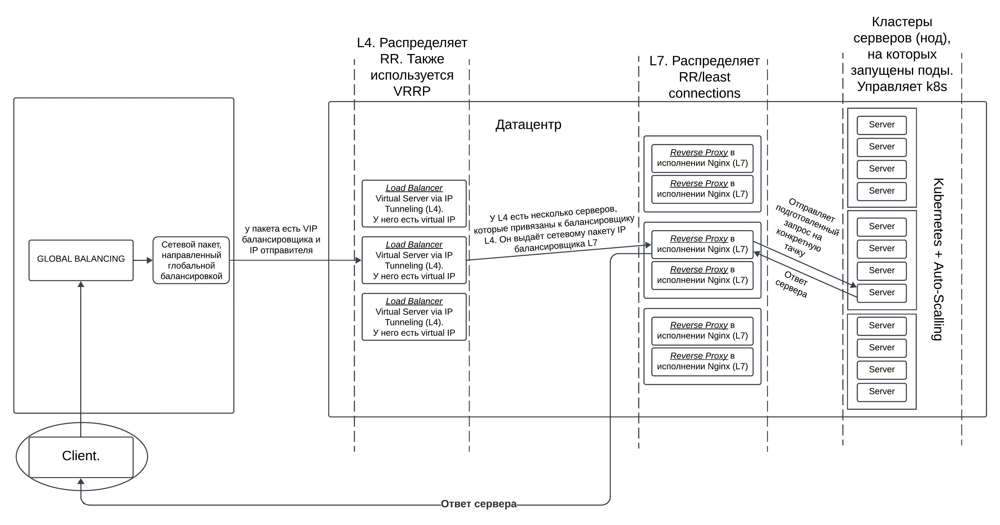
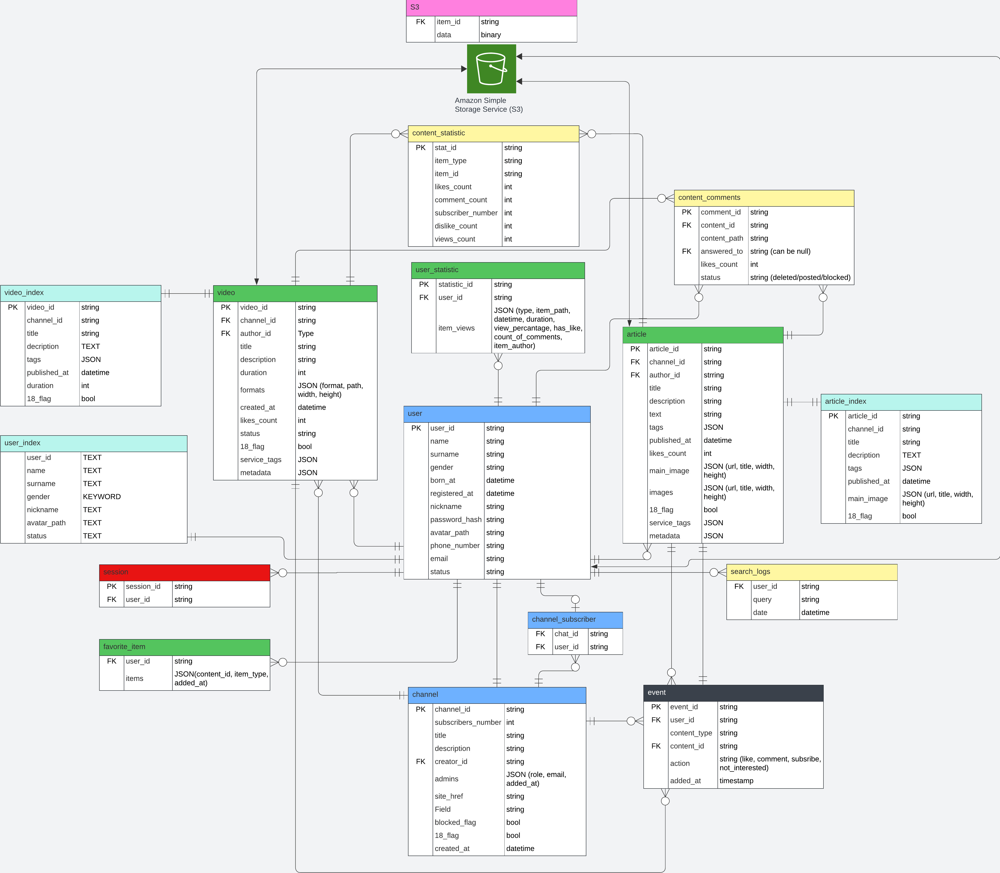

### Курсовая работа по проектированию высоконагруженных систем
### _выполняет студент ИУ9-52Б Черников Артём_

## 1. Тема и целевая аудитория

## Сервис-аналог: Дзен

## Тип сервиса:
**Блог-платформа** для создания и просмотра контента (статьи, фото, видео).

## Функциональность MVP:
1. **Регистрация и авторизация пользователей**
2. **Публикация медиаконтента** (возможность загружать и публиковать статьи, фотографии, видео)
3. **Просмотр контента** (пользователи могут просматривать контент, найденный в поиске, на страницах других пользователей, среди рекомендованных публикаций, а также в избранном и истории просмотров)
4. **Подписки на пользователей** (возможность подписываться на интересующих пользователя авторов)
5. **Комментирование** (написание комментариев к публикациям и другим комментариям)

## Навигация:
- **Главная страница** (персонализированная лента с рекомендованными публикациями на основе интересов пользователя)
- **Подписки** (список авторов, на которых подписан пользователь)
- **Популярное** (публикации с наибольшим количеством просмотров за последнюю неделю)
- **Избранное** (список публикаций, отмеченных пользователем как избранные)
- **История** (список уже просмотренных пользователем публикаций)
- **Профиль** (раздел с информацией о пользователе и возможностью изменения некоторых данных)
- **Видео** (лента с видеоконтентом, подобранная на основе интересов пользователя)
- **Поиск** (поиск по всему контенту сервиса с возможностью фильтрации по тексту, заголовкам и популярным хештегам)

## Аудитория[^2]:
Платформой пользуются люди **от 12 до 80 лет**, при этом основная аудитория (**25-44 года**) составляет более половины пользователей. **60% пользователей** – женщины. Сервис посещают **80 млн человек ежемесячно** и **31,8 млн ежедневно**, причем **90% трафика** поступает из России и стран СНГ. **56% пользователей** заходят на платформу со смартфонов.

## Ключевые продуктовые решения:
- **Алгоритм подбора рекомендаций** на основе интересов пользователя (по хештегам, сервисным тегам)
- **Монетизация контента**
- **Возможность правки публикаций LLM**
- **Хештеги** (использование хештегов для классификации и поиска контента)
- **Шортсы** (короткие видео)

---

## 2. Расчет нагрузки
MAU: **80 млн**  
DAU: **31,8 млн**[^1]

### 2.1 Расчёт хранилища под одного пользователя
Средний размер хранилища личных данных пользователя с каналом: 
1.	Аватар – в сжатом виде до 300 КБ
2.	Настройки – 2 КБ (данные пользователя: возраст, пол; уведомления, контакты, настройки)
3.	Данные для системы рекомендаций публикаций - до 200 КБ 
### _как это считалось - чуть ниже_
### Средний размер хранилища пользователя с каналом:

| Данные              | Размер контента                      |
|---------------------|--------------------------------------|
| Аватар              | 300 КБ                                 |
| Настройки           | 2 КБ (данные пользователя: возраст, пол, уведомления, контакты, настройки) |
| Данные для рекомендательной системы| 200 Кб|

### общая таблица с размером хранилища
| Тип контента      | Средний общий объём на автора  |
|-------------------|--------------------------------|
| Видео             | 80 ГБ                          | 
| Статьи и посты    | 2,35 ГБ                        | 
| Личные данные     | 0,5 МБ                         |
| **Итого**         | 82,35 ГБ                       |

### 2.1a Видео

В 2023 году было загружено:
- **5 000 000 коротких видео**.
- **6 000 000 длинных видео**.
- Количество авторов видео: **500 000**[^2].

В среднем на каждого активного автора приходится:
- **10 коротких видео** (5 000 000 / 500 000).
- **12 длинных видео** (6 000 000 / 500 000).

Исходя из данных о размерах видео - расчёт [тут](#Расчёт-размера-видео):
- Короткие видео (до 2 минут, но для расчёта 1:45) — **5 МБ**.
- Длинные видео (до 8 часов, но возьмём для расчёта 4 часа) — **4,5 ГБ**.

### Расчёт объёма хранилища на одного автора:
- **Короткие видео**: 10 видео * 78,5 МБ = **785 МБ**.
- **Длинные видео**: 12 видео * 11,7 ГБ = **140,4 ГБ**.

Итого на одного активного автора в 2023 выделяется **~141 ГБ** хранилища для видео. Посчитаем теперь за все годы, но для начала рассмотрим изменение количества авторов.

### Количество авторов по годам:

Количество активных авторов (тех, кто загружает видео) изменялось с годами. Примерно по следующим данным:
- **2019 год**: **70 000** авторов.
- **2020 год**: **100 000** авторов (из них **45 000** регулярно публиковали в неделю)[^3].
- **2021 год**: **200 000** авторов (из них **50 000** регулярно публиковали в неделю)[^4].
- **2022 год**: **400 000** авторов (из них **100 000** регулярно публиковали в неделю)[^5].
- **2023 год**: **500 000** авторов[^2].

### Объём хранилища на одного автора за каждый год

Расчёт объёма хранилища на одного активного автора в зависимости от года:
- **2019 год**: **5 ГБ/автора в год**.
- **2020 год**: **18 ГБ/автора в год**.
- **2021 год**: **90 ГБ/автора в год** (рост в 5 раз по сравнению с 2020 годом)[^4].
- **2022 год**: **101 ГБ/автора в год** 
- **2023 год**: **141 ГБ/автора в год**.  (увеличение на 40% по сравнению с 2022 годом)[^5].
- **2024 год**: **170 ГБ/автор в год** (прогноз, в связи с невозможностью просмотра/выгрузки видео на YouTube, пользователи переходят на альтернативные контент-площадки)

Итого для старого пользователя(публикующим видео с 3 квартала 2019 года), который был активен все годы: **355 ГБ**.  
Для новых пользователей, которые начали загружать видео только в 2023 году, требуется **141 ГБ**.  
Учитывая прирост активных авторов по годам, можно рассчитать, что средний объём хранилища, выделенный на одного активного автора, составляет **около 300 ГБ**. С учётом текущего года нужно рассчитывать на дополнительный объём видео в **170 ГБ**, загруженного пользователем. То есть, общий объём видео, загруженного среднестатистическим автором, публикующего видеоконтент, составит около **470 ГБ** 

### Расчёт размера видео

#### Расчёты для короткого видео (1 минута 45 секунд)

| Разрешение | Битрейт (Мбит/с) | Объём до сжатия (МБ) | Объём после сжатия (МБ) |
|------------|------------------|----------------------|-------------------------|
| 1080p      | 5                | 65                   | 33                      |
| 720p       | 3                | 39                   | 20                      |
| 480p       | 2                | 26                   | 10                      |
| 360p       | 1.5              | 20                   | 7.5                     |
| 240p       | 1                | 13                   | 5                       |
| 160p       | 0.5              | 6                    | 3                       |

_Итого общий вес всех разрешений короткого видео_ : **78,5 МБ**

#### Расчёты для длинного видео (4 часа)

| Разрешение | Битрейт (Мбит/с) | Объём до сжатия (ГБ) | Объём после сжатия (ГБ) |
|------------|------------------|----------------------|-------------------------|
| 1080p      | 5                | 9                    | 4.5                     |
| 720p       | 3                | 5.4                  | 2.7                     |
| 480p       | 2                | 3.6                  | 1.8                     |
| 360p       | 1.5              | 2.7                  | 1.35                    |
| 240p       | 1                | 1.8                  | 0.9                     |
| 160p       | 0.5              | 0.9                  | 0.45                    |

_Итого общий вес всех разрешений длинного видео_ : **11,7 ГБ**

### Примечания для расчётов:
- **Трафик и вес на сервере** рассчитываются по стандартной формуле:  
 _Объём = Битрейт (Мбит/с) × (Длительность видео (с) × (1 Мбит/8)) / 1024_

  для получения результата в МБ/ГБ.
- **Сжатие**: учитывает снижение объёма в 2 раза.

_таблица для хранилища одного пользователя, публикующего видео_

| Год      | Количество активных авторов | Объём хранилища на одного автора, ГБ | Общий объём хранилища, ТБ |
|----------|-----------------------------|--------------------------------------|---------------------------|
| 2019     | 70 000                      | 5 ГБ                                | 350                       |
| 2020     | 100 000                     | 18 ГБ                               | 1 800                     |
| 2021     | 200 000                     | 90 ГБ                               | 18 000                    |
| 2022     | 400 000                     | 101 ГБ                              | 40 400                    |
| 2023     | 500 000                     | 141 ГБ                              | 70 500                    |
| 2024 (прогноз) | 600 000               | 170 ГБ                              | 102 000                   |
| **Итого**| **-**                       | **Средний объём: ~300 ГБ/автор**     | **233 050 ТБ**             |

Средний объём хранилища на одного активного автора — **~300 ГБ**, а общий объём хранилища к 2024 году (с учётом роста количества авторов и увеличения размера данных) составит **233 050 ТБ**.

## 2.1b Расчёт хранилища под одного пользователя для статей

### 1. Данные о статьях

В 2023 году было опубликовано:
- **20 000 000 постов**[^2].
- **14 000 000 статей**.
- Количество авторов: **700 000**.

Значит, в среднем на каждого этого автора приходится:
- **29 постов**.
- **20 статей**.
Эти данные будем считать константыми и для других годов, ведь активность авторов особо не меняется.

### Сколько весит 1 статья:
Т.к 1 символ в кодировке UTF-8 весит 1 байта, а средний размер статьи на Дзен 3000-5000 знаков с учётом пробелов (личный опыт), то средний вес статьи: 4000/1000 = 4 КБ.

1. **Текст** — **4 КБ**.
2. **Данные статьи** (метаданные, хештеги и прочее) — **1 КБ**.
3. **Картинки**: 
   - В статье в среднем **5 картинок**.
   - Средний вес картинки — **500 КБ**.
   - Итого: **5 картинок * 0,5 МБ = 2,5 МБ**.
   - После сжатия: **~2,5 МБ** на статью.

### Итого расчёт объёма хранилища для статьи:

- **Текст и данные**: 4 КБ + 1 КБ = **5 КБ**.
- **Картинки** (с учётом сжатия): **2,5 МБ**.

Итого, одна статья занимает **~2,5 МБ** хранилища.

### Сколько весит пост

1. **Текст** — **1 КБ**.
2. **Данные** — **1 КБ**.
3. **Картинка** (с учётом сжатия): **0,5 МБ**.

### Итого расчёт объёма хранилища для поста:
- **Текст и данные**: 1 КБ + 1 КБ = **2 КБ**.
- **Картинка**: **0,5 МБ**.

Итого, один пост занимает **~500 КБ**.

## Объём хранилища на одного пользователя на один год

На одного пользователя приходится:
- **29 постов** * **500 КБ** = **~14,5 МБ** для постов.
- **20 статей** * **2500 КБ** = **~50 МБ** для статей.

_таблица годового хранилища среднестатистического пользователя, публикующего статьи_

| Тип контента      | Количество на автора в год | Размер одного контента | Общий объём на автора в год | Общий объём на автора за 9 лет |
|-------------------|---------------------------|------------------------|----------------------------|--------------------------------|
| Посты             | 29                        | 0,5 МБ                 | 14,5 МБ                    | 130,5 МБ                       |
| Статьи            | 20                        | 2,5 МБ                  | 50 МБ                     | 450 МБ                         |
| **Итого**         | **-**                     | **-**                  | **64,5 МБ**               | **580,5 МБ**                    |

Итого на одного пользователя в год выделяется **~64,5 МБ** хранилища для контента (статей и постов) в год. Значит, с момента существования сервиса, у самого старого юзера будет 9 лет * 64,5 МБ занимаемое хранилище, то есть, **580,5 МБ**. Но это самый предельный усреднённый вариант, ведь большая часть авторов у Дзена появилась с 2021 по 2023 года. Значит, для расчёта возьмём с 2021 года: 3 * 64,5 = **193,5 МБ** в среднем занимает хранилище одного автора статей сейчас. С учётом 2024 года оно будет составлять **258 МБ**

Значит, на хранение статей всех авторов с учтом надо выделить 180600 ГБ = **180,6 ТБ**

Подводим итог вычислений: на хранение всех данных пользователей на сервере надо выделить: 233 050 ТБ + 180,6 ТБ = ~234 000 ТБ = **234 ПБ**

## Технические метрики:
В отчёте Дзена за 2021 год указано, что суммарно пользователи смотрели контент ~580 млн минут в день, на тот момент DAU был равен 22 млн => 26 минут в день проводят в среднем в Дзене, и этот показатель не сильно поменялся до 2024.
### Действия пользователей:

| Действие                         | Частота действий на пользователя в день  |
|-----------------------------------|------------------------------------------|
| Регистрация и авторизация         | 0,033 раза (1 раз в месяц)               |
| Публикация медиаконтента          | 0,13 раза[^1]                               |
| Просмотр контента                 | 4 раза для статей, 20 раз для коротких видео |
| Подписки на пользователей, лайки, репосты, добавление в избранное         | 5 раз                                   |
| Комментирование                   | 0,015 раз[^2]                               |
| Просмотр главной страницы                    | 1 раз               |
| Просмотр популярного                    | 0.5 раза                |
| Поиск                  | 0,2 раза           | 
| Избранное                  | 0,2 раза                |
| Видео (старница)                  | 1раз               |

### RPS (Requests Per Second) на основные действия:

| Действие                         | Формула                                | RPS   |
|-----------------------------------|----------------------------------------|-------|
| Регистрация и авторизация         | 0,033 * 32 000 000 / 86 400                     | 12    |
| Публикация медиаконтента          | 0,13 * 32 000 000 / 86 400             | 48    |
| Просмотр контента (статьи)        | 4 * 32 000 000 / 86 400                | 1 480 |
| Просмотр контента (видео)         | 20 * 32 000 000 / 86 400               | 7 407 |
| Подписки на пользователей, лайки, репосты, добавление в избранное          | 5 * 32 000 000 / 86 400                | 1850   |
| Комментирование                   | 0,015 * 32 000 000 / 86 400            | 5     |
| Просмотр главной страницы                    | 3 * 32 000 000 / 86 400                | 1010 |
| Просмотр популярного                    | 0.5 * 32 000 000 / 86 400                | 185 |
| Поиск                  | 0,4 * 32 000 000 / 86 400                | 150 |
| Избранное                  | 0,2 * 32 000 000 / 86 400                | 74 |
| Видео (старница)                  | 1 * 32 000 000 / 86 400                | 370 |
| Запрос рекламы |считаем как сумму запросов страниц, где показывается реклама: 1480+7407+370+185+370 |9812|

### Сетевой трафик
Рассчитаем сначала суммарный суточный для видео: учитывая, что MAU = 32млн, а пользователи суммарно проводят в Дзене 840млн минут, из которых 337 - это видео, и зная средний битрейт большого видео (3Мбит/с) и короткого (0,5Мбит/с), то предположим, что за день польователь 1/3 своего времени тратит на длинные видео, а 2/3 на короткие. Итого можно подсчитать общий сетевой трафик в сутки: 337млн минут * (1/3 * 3 + 2/3 * 0,5) * 60 /1000 = ~27 000 000 Гбит/день = 3375000 ГБайт = **3,4 ПБ суммарный сетевой трафик на видео** 

Из этих данных посчитаем средний трафик на просмотр видео: 14 400 000/(24*60*60) = 312,5 Гбит/с
Загрузка контента в несколько десятков раз отличается от просмотра контента, поэтому средний трафик загрузка видео пользователем будем считать 10 Гбит/с
Загрузка статей: 4 статьи * 19,5 млн человек, кто читает статьи * вес одной статьи 2,5МБ / (24*60*60) = 2,5 ГБит/с

#### Обычный (330 Гбит/с):

| Действие                         | Скорость трафика                       |
|-----------------------------------|----------------------------------------|
| Загрузка видео пользователем      | 10 Гбит/с                              |
| Просмотр видео                    | 312,5 Гбит/с                              |
| Загрузка статей                   | 3 Гбит/с                               |
| Загрузка и подбор рекламы         | 2 Гбит/с                              |
| Загрузка превью статей и видео    | 2 Гбит/с                               |

Пиковый = 166,7 * коэффициент 2,5 = ~416 Гбит/с на видео, примерно с таким же коэффициентом рассчитаем нагрузку на другие функциональности:

#### Пиковый (725 Гбит/с) [информация частично подтверждена CTO Дзена](https://t.me/kondra2lp):
| Действие                         | Скорость трафика                       |
|-----------------------------------|----------------------------------------|
| Загрузка видео пользователем      | 15 Гбит/с                              |
| Просмотр видео                    | 700 Гбит/с                              |
| Загрузка статей                   | 8 Гбит/с                               |
| Загрузка и подбор рекламы         | 5 Гбит/с                              |
| Загрузка превью статей и видео    | 6 Гбит/с                              |

## 3. Глобальная балансировка нагрузки
---
### Разбиение по доменам
Разбиение на поддомены позволяет управлять микросервисами и управлять нагрузкой и производительностью.
- www.dzen.ru: Основной веб-домен для публичного доступа к сервису Дзена. Представляет собой основной пользовательский интерфейс, через который пользователи взаимодействуют с платформой. Он координирует взаимодействие с поддоменами. 
- m.dzen.ru: мобильная версия сайта. Этот поддомен специально оптимизирован для работы на мобильных устройствах.
- log.dzen.ru: обработка логов. Это может включать данные о работе сервиса, действиях пользователей и мониторинг систем. Он необходимы для аналитики и отладки системы.  
- passport.dzen.ru: Поддомен для аутентификации пользователей, отвечает за вход в систему и управление профилем пользователя.  
- clck.dzen.ru: сервис отслеживания переходов по ссылкам. Он помогает анализировать активность пользователей и строить метрики по кликам.  
- cdn.dzen.ru: Используется для доставки статического контента (CSS, JavaScript, изображения, видео) через сеть CDN, что улучшает скорость загрузки сайта не только по России, но и по всему миру.
- suggest.dzen.ru: Отвечает за систему рекомендаций, которую Дзен использует для персонализации контента - автодополнение запросов, персональные рекомендации на основе предыдущей активности пользователя.[^9]   
[Схема поддоменов Дзена](domains_of_dzen.png)

### Расположение датацентров:
Соцсетью Дзен пользуются каждый месяц 80 млн человек, 90% из них это жители России. [^7]
| География     | Процент |
|---------------|---------|
| Москва, СПБ   | 34%     |
| Города > 1 млн| 25%     |
| > 500к        | 11%     |
| Другие        | 30%     |

Как видим, 34% пользователей из Москвы и Санкт-Петербурга и ещё 25% из других городов-милионников. Было бы логично поставить основные датацентры в Москве и Санкт-Петербурге, Красноярске и Владивостоке - это позволит сделать latency небольшим для все регионов страны. 

### DNS балансировка:
Так как к одному доменному имени будет привязано несколько ip-адресов, то на этом уровне глобальной балансировки будем отдавать разный ip-адрес датацентра ещё на уровне резолвинга доменного имени. При балансировке на уровне DNS используется алгоритм Latency-based Load Balancing - это распределение запросов по датацентрам в зависимости от задержки времени ответа сервера, то есть от latency. Такой способ балансировки очень удобен, так как выданный на этом этапе ip-адрес датацентра хранится днями, и не нужно иметь большое количество DNS серверов. 

### CDN:
Так как Дзен - это социальная сеть для обмена контентом, которого в ней на данный момент очень много, необходимо использование **_CDN_** для его доставки клиенту. CDN - Content Delivery Network, его суть заключается в кэшировании на EDGE-серверах. Пользователю будет возвращён статический контент (изображения, видео, стили CSS, JavaScript) с ближайщего к нему EDGE-сервера, если его кэш там есть. Этот подход помогает снизить latency и нагрузку на основные сервера. Также это помогает быстрой загрузке контента у пользователей по всему миру. 

## 4. Локальная балансировка нагрузки
---
## Локальная балансировка сервиса ДЗЕН

В этом разделе рассмотрим локальную балансировку сервиса ДЗЕН. Для начала приведу схему локальной балансировки:

### А теперь про каждый уровень поподробнее:

### L4 (транспортный уровень модели OSI)[^10]:
Я выбрал метод **Virtual Server via IP Tunneling**, потому что он решает основные проблемы перегрузки балансировщика трафиком и по CPU и при этом не требует использования широковещательных ethernet-сегментов. Его основные преимущества в том, что он инкапсулирует оригинальные запросы в новые IP-пакеты и передаёт их на серверы, которые имеют локальный интерфейс с одинаковым VIP балансировщика. Сервер, в свою очередь, отправляет ответ уже сразу клиенту.

### VRRP (Virtual Router Redundancy Protocol):
Используется для отказоустойчивости балансировщиков. Заключается в том, что несколько балансировщиков объединяются в виртуальную группу, и один становится master, а остальные — backup. Если главный выходит из строя, то один из резервных берёт на себя его функции и становится master.

Тогда встаёт вопрос, как понять, что сервер вышел из строя — будем проверять работоспособность с помощью HTTP/HTTPS запросов. Такой **health check** может точно убедиться, что не только сервер, но и приложение на нём работают.

### L7 (прикладной уровень):
На уровне L7 балансировки используется **HTTP Reverse Proxy**. Могут использоваться разные реализации (например, HAProxy весьма популярен), но я выбрал именно **Nginx**, потому что он является многофункциональным и распространённым.

Реверс-прокси максимально упрощает управление запросами и выполняет:

1. Объединение TCP-соединений (поддерживает постоянные соединения с серверами, уменьшая количество соединений, которое требуется для обработки от каждого клиента).
2. Сохранение сессий (чтобы запросы от одного клиента всегда попадали на один и тот же сервер).
3. Кеширование (чтобы не отправлять постоянно каждый запрос на сервер, можно что-то сохранять на сервере прокси).
4. SSL Termination (расшифровка HTTPS на прокси, а на сервер шлём уже HTTP запросы).

На данном уровне будем использовать алгоритмы в зависимости от типа запроса — **Round Robin** или **Least Connection** (особенно хорош для блокирующего софта с длинным ответом на запросы).

### Kubernetes:
Мы будем использовать систему оркестрации **Kubernetes**, чтобы не запускать экземпляры приложения вручную на серверах (bare metal). Kubernetes берет на себя **service discovery** — управляет сервисами и динамически отслеживает список активных экземпляров с помощью механизма **Service** и **Endpoints**[^11].

Kubernetes добавляет экземпляр в реестр после успешного прохождения **readiness-пробы**, что подтверждает его готовность принимать трафик. Он также распределяет поды (экземпляры) по узлам, перезапускает их или перераспределяет при сбоях. Кроме того, Kubernetes автоматически выполняет масштабирование с помощью **auto-scaling**, таких как **Horizontal Pod Autoscaler (HPA)**, который регулирует количество подов в зависимости от нагрузки.

## 5. Логическая схема базы данных
---
## Иллюстрация:  

### Описание таблиц, размеры и консистентность:  

### **Таблица: `video`** 
| Атрибут        | Тип данных  | Размер, байт |
|----------------|-------------|--------------|
| video_id       | string      | 16           |
| channel_id     | string      | 16           |
| author_id      | string      | 16           |
| title          | string      | до 100       |
| description    | TEXT        | до 5000      |
| duration       | int         | 4            |
| formats        | JSON        | до 100       |
| created_at     | datetime    | 8            |
| 18_flag        | bool        | 1            |
| status         | string      | 16           |
| metadata       | JSON        | до 256       |

**Размер записи**: ~5 КБ, всего видео: ~50 млн, общий вес: **250 ГБ**  
**Нагрузка**: чтение: 14000 RPS, запись: 1480 RPS  

### **Таблица: `article`** 
| Атрибут      | Тип данных  | Размер, байт |
|--------------|-------------|--------------|
| article_id   | string      | 16           |
| channel_id   | string      | 16           |
| author_id    | string      | 16           |
| title        | string      | до 128       |
| text         | TEXT        | до 1500      |
| likes_count  | int         | 4            |
| main_image   | JSON        | до 100       |
| images       | JSON        | до 600       |
| tags         | JSON        | до 100       |
| service_tags | JSON        | до 256       |
| published_at | datetime    | 8            |
| status       | string      | 16           |

**Размер записи**: ~2 КБ, всего статей: ~200 млн, общий вес: **400 ГБ**  
**Нагрузка**: чтение: 2800 RPS, запись: 28 RPS  

### **Таблица: `content_comments`**
| Атрибут     | Тип данных  | Размер, байт |
|-------------|-------------|--------------|
| comment_id  | string      | 16           |
| content_id  | string      | 16           |
| author_id   | string      | 16           |
| answered_to | string      | 16 (nullable) |
| likes_count | int         | 4            |
| status      | string      | 16           |

**Размер записи**: ~72 Б, всего комментариев: ~300 млн, общий вес: **21 ГБ**  
**Нагрузка**: чтение: 1480 RPS, запись: 3 RPS  

### **Таблица: `user`**
| Атрибут         | Тип данных  | Размер, байт |
|-----------------|-------------|--------------|
| user_id         | string      | 16           |
| name            | string      | до 64        |
| surname         | string      | до 64        |
| gender          | string      | 1            |
| born_at         | date        | 8            |
| registered_at   | datetime    | 8            |
| nickname        | string      | 32           |
| password_hash   | string      | 64           |
| avatar_path     | string      | 64           |
| email           | string      | до 300       |
| status          | string      | до 16        |
| metadata        | JSON        | до 256       |

**Размер записи**: ~32 КБ, всего пользователей: ~100 млн, общий вес: **3,2 ТБ**  
**Нагрузка**: чтение: 15 RPS, запись: 12 RPS  

### **Таблица: `session`**
| Атрибут    | Тип данных  | Размер, байт |
|------------|-------------|--------------|
| session_id | string      | 16           |
| user_id    | string      | 16           |

**Размер записи**: ~32 Б, всего сессий: ~80 млн, общий вес: **2,5 ГБ**  
**Нагрузка**: чтение: 12500 RPS, запись: 6 RPS  

### **Таблица: `channel`**
| Атрибут            | Тип данных  | Размер, байт |
|--------------------|-------------|--------------|
| channel_id         | string      | 16           |
| subscribers_number | int         | 4            |
| title              | string      | до 140       |
| description        | TEXT        | до 200       |
| site_href          | string      | до 64        |
| blocked_flag       | bool        | 1            |
| 18_flag            | bool        | 1            |
| created_at         | datetime    | 8            |
| admins             | JSON        | до 128       |
| metadata           | JSON        | до 256       |

**Размер записи**: ~588 Б, всего каналов: ~100 млн, общий вес: **58 ГБ**  
**Нагрузка**: чтение: 2000 RPS, запись: 12 RPS  

### **Таблица: `channel_subscriber`**
| Атрибут       | Тип данных  | Размер, байт |
|---------------|-------------|--------------|
| ch_sub_id     | string      | 16           |
| channel_id    | string      | 16           |
| user_id       | string      | 16           |

**Размер записи**: ~48 Б, всего подписок: ~800 млн, общий вес: **38 ГБ**  
**Нагрузка**: чтение: 2000 RPS, запись: 10 RPS  

### **Таблица: `content_statistic`**
| Атрибут       | Тип данных  | Размер, байт |
|---------------|-------------|--------------|
| stat_id       | string      | 16           |
| item_type     | string      | 16           |
| item_id       | string      | 16           |
| likes_count   | int         | 4            |
| comment_count | int         | 4            |
| dislike_count | int         | 4            |
| views_count   | int         | 4            |
| subscriber_number | int     | 4            |

**Размер записи**: ~64 Б, всего записей: ~200 млн, общий вес: **12 ГБ**  
**Нагрузка**: чтение: 2000 RPS, запись: 2000 RPS  

### **Таблица: `user_statistic`**
| Атрибут       | Тип данных  | Размер, байт |
|---------------|-------------|--------------|
| statistic_id  | string      | 16           |
| user_id       | string      | 16           |
| item_views    | JSON        | до 200       |

**Размер записи**: ~432 Б, всего записей: ~100 млн, общий вес: **43 ГБ**  
**Нагрузка**: чтение: 2000 RPS, запись: 12000 RPS  

### **Таблица: `favorite_item`**
| Атрибут     | Тип данных  | Размер, байт |
|-------------|-------------|--------------|
| user_id     | string      | 16           |
| items       | JSON        | до 100       |

**Размер записи**: ~72 Б, всего записей: ~500 млн, общий вес: **36 ГБ**  
**Нагрузка**: чтение: 1000 RPS, запись: 500 RPS  

### **Таблица: `search_logs`**
| Атрибут  | Тип данных  | Размер, байт |
|----------|-------------|--------------|
| user_id  | string      | 16           |
| query    | string      | до 256       |
| date     | datetime    | 8            |

**Размер записи**: ~48 Б, всего записей: ~80 млн, общий вес: **3,8 ГБ**  
**Нагрузка**: чтение: 150 RPS, запись: 150 RPS  

### **Таблица: `video_index`**
| Атрибут      | Тип данных  | Размер, байт |
|--------------|-------------|--------------|
| channel_id   | string      | 16           |
| title        | string      | до 100       |
| description  | TEXT        | до 5000      |
| metadata     | JSON        | до 256       |
| published_at | datetime    | 8            |
| 18_flag      | bool        | 1            |

**Размер записи**: ~5 КБ, всего записей: ~50 млн, общий вес: **250 ГБ**  
**Нагрузка**: чтение: 1000 RPS, запись: 50 RPS  

### **Таблица: `article_index`**
| Атрибут      | Тип данных  | Размер, байт |
|--------------|-------------|--------------|
| channel_id   | string      | 16           |
| title        | string      | до 128       |
| description  | TEXT        | до 1500      |
| metadata     | JSON        | до 256       |
| published_at | datetime    | 8            |
| main_image   | JSON        | до 100       |
| 18_flag      | bool        | 1            |

**Размер записи**: ~2 КБ, всего записей: ~200 млн, общий вес: **400 ГБ**  
**Нагрузка**: чтение: 500 RPS, запись: 25 RPS  

### **Таблица: `user_index`**
| Атрибут      | Тип данных  | Размер, байт |
|--------------|-------------|--------------|
| user_id      | string      | 16           |
| name         | string      | до 64        |
| surname      | string      | до 64        |
| gender       | string      | 1            |
| nickname     | string      | до 32        |
| avatar_path  | string      | до 64        |
| status       | string      | до 16        |

**Размер записи**: ~1 КБ, всего записей: ~100 млн, общий вес: **100 ГБ**  
**Нагрузка**: чтение: 1500 RPS, запись: 10 RPS  

### **Таблица: `event`**
| Атрибут      | Тип данных  | Размер, байт |
|--------------|-------------|--------------|
| user_id      | string      | 16           |
| channel_id   | string      | 16           |
| content_id   | string      | 16           |
| type         | string      | 16           |
| added_at     | timestamp   | 8            |

**Размер записи**: ~72 Б, всего записей: ~1 млрд, общий вес: **72 ГБ**  
**Нагрузка**: чтение: 5000 RPS, запись: 3000 RPS  

## 6. Физическая схема базы данных  
---
## Физическая схема базы данных:  

## Таблица с описание таблиц:    

| **Таблица**             | **Описание**                                                                 | **БД**          | **Причина выбора**                              |
|-------------------------|-------------------------------------------------------------------------------|----------------|------------------------------------------------|
| `video`                 | Содержит информацию о видео (заголовок, описание, автор, форматы, метаданные). | **MongoDB**     | Хранение данных с гибкой структурой, включая JSON. Хорошо подходит для данных с большим количеством вложенных полей и метаданных. |
| `article`               | Хранит статьи и связанные с ними данные (заголовок, текст, теги, изображения). | **MongoDB**     | Гибкость в структуре и поддержка документов JSON, позволяющая хранить текстовые данные и метаданные в единой структуре. |
| `content_comments`      | Комментарии к контенту, включая ответы и статус комментария.                  | **ClickHouse**  | Высокая скорость записи и агрегации для анализа большого объема данных. Идеально для хранения комментариев с аналитическими запросами. |
| `user`                  | Данные пользователей (имя, email, аватар, статус и информация о регистрации).  | **PostgreSQL**  | Надежная реляционная БД для строгих требований к целостности данных. Хорошо подходит для хранения данных пользователей с четкой структурой. |
| `session`               | Сессии пользователей (для трекинга авторизаций).                              | **Redis**       | Быстрая in-memory БД для хранения временных данных, таких как сессии. Обеспечивает мгновенный доступ и обновление данных. |
| `channel`               | Информация о каналах, включая описание и количество подписчиков.              | **PostgreSQL**  | Подходит для структурированных данных с четкими связями между таблицами. Обеспечивает целостность данных и поддерживает связи. |
| `channel_subscriber`    | Связи между пользователями и каналами (подписки).                             | **PostgreSQL**  | Оптимально для реляционных данных с возможностью выполнения JOIN-запросов. |
| `content_statistic`     | Статистика взаимодействий с контентом (лайки, просмотры, комментарии).        | **ClickHouse**  | Высокая производительность для аналитических запросов по большим объемам данных. Идеально подходит для статистики. |
| `user_statistic`        | Статистика просмотров пользователя (история видео и статей).                  | **MongoDB**  | Гибкость в структуре и поддержка документов JSON, позволяющая хранить текстовые данные и метаданные в единой структуре, быстрая запись |
| `favorite_item`         | Избранные элементы пользователя (статьи и видео).                             | **PostgreSQL**  | Подходит для хранения четко структурированных данных с возможностью выполнения сложных запросов. |
| `search_logs`           | Логи поиска пользователей.                                                    | **ClickHouse**  | Высокая производительность для хранения и анализа логов с возможностью быстрых агрегатов и аналитики. |
| `video_index`           | Индекс для ускорения поиска видео                                                    | **ElasticSearch**  | Отличный инструмент, проверенный временем и со множеством гайдов|
| `article_index`           | Индекс для ускорения поиска статей                                                    | **ElasticSearch**  | Отличный инструмент, проверенный временем и со множеством гайдов|
| `user_index`           | Индекс для ускорения поиска пользователей                                                    | **ElasticSearch**  | Отличный инструмент, проверенный временем и со множеством гайдов|
| `event`           | Для сбора пользовательских "логов"                                                   | **Kafka**  | Высокая производительность, похволяет обрабатывать большие объёмы данных, хорошо держит нагрузку, отказоустойчива|

## Индексы:
 ### **Индексы таблиц**

Для оптимизации запросов и обеспечения высокой производительности в ДЗЕНе будем использовать следующие индексы:

| **Таблица**            | **Индексы**                     |
|------------------------|----------------------------------|
| **`user`**             | `user_id`, `email`, `nickname`  |
| **`video`**            | `video_id`, `author_id`          |
| **`article`**          | `article_id`, `author_id`        |
| **`content_comments`** | `comment_id`                    |
| **`content_statistic`**| `item_id`                       |
| **`channel`**          | `channel_id`                    |
| **`search_logs`**      | `user_id`                       |

## Шардирование  

| **Таблица**             | **Индексы**                                                                 | **Шардирование** | Резервирование|
|-------------------------|-------------------------------------------------------------------------------|----------------|------------|
| `video`                 | `video_id`, `author_id`   | хеширование по channel_id     | backup  с помощью mongodump, дублирующие таблицы (отношение master - slave) |
| `article`               | `article_id`, `author_id` | хеширование по channel_id      | backup  с помощью mongodump, дублирующие таблицы (отношение master - slave)|
| `content_comments`      |  `comment_id`                 | хеширование по content_id   | Инкрементное резервирование с ALTER TABLE ... FREEZE |
| `user`                  | `user_id`, `email`, `nickname`  | дублирующие таблицы (отношение master - slave) |
| `session`               | -                             | -       | RDB + AOF |
| `channel`               | `name`              | хеширование по channel_id  | дублирующие таблицы (отношение master - slave) | 
| `channel_subscriber`    | -                          | хеширование по user_id  | дублирующие таблицы (отношение master - slave) |
| `content_statistic`     | `item_id`        | хеширование по channel_id  | Инкрементное резервирование с ALTER TABLE ... FREEZE |
| `user_statistic`        | `user_id`                  |  хеширование по user_id  | backup  с помощью mongodump, дублирующие таблицы (отношение master - slave) |
| `favorite_item`         | `user_id`                           |  хеширование по user_id  | backup  с помощью mongodump, дублирующие таблицы (отношение master - slave) |
| `search_logs`           | `user_id`                                                     | хеширование по user_id  | Инкрементное резервирование с ALTER TABLE ... FREEZE |
| `events`           | `user_id`                                                   | хеширование по user_id  | Облачное резервное копирование с использованием Kafka Tiered Storage |

Также используется прешардинг, чтобы потом не мучиться с перераспределением из-за увеличением шардов  

### Клиентские библиотеки

**библиотеки для языка Go:**
- Redis: github.com/go-redis/redis
- Apache Kafka: github.com/confluentinc/confluent-kafka-go
- ClickHouse: github.com/ClickHouse/clickhouse-go
- Elasticsearch: github.com/elastic/go-elasticsearch
- s3: github.com/aws/aws-sdk-go
- PostgreSQL: github.com/lib/pq
- MongoDB: go.mongodb.org/mongo-driver

---  
## ДЗ 7:

### 1) Alternating Least Squares (ALS)

### Область применения
ALS используется в рекомендательных системах, обработке больших данных и для поиска релевантного контента по предпочтениям пользователей. Метод особенно эффективен в динамических системах, где предпочтения пользователей могут быстро меняться.

### Мотивация
Использование ALS в рекомендательных системах позволяет разложить данные о взаимодействиях пользователей и документов на вектора, что помогает выявить скрытые предпочтения пользователей и предложить им релевантный контент. Метод позволяет моделировать предпочтения, создавая "общий язык" признаков, который понимают и пользователи, и документы. Это улучшает качество рекомендаций и снижает затраты на вычисления при больших объемах данных.

### Описание алгоритма

1. **Инициализация**  
   На начальном этапе вектора пользователей и документов инициализируются случайными значениями. Эти вектора будут оптимизироваться для минимизации ошибки.

2. **Оптимизация векторов пользователей**  
   Фиксируем вектора документов и подбираем такие вектора пользователей, которые минимизируют ошибку между реальными и предсказанными оценками взаимодействий. Этот шаг помогает уточнить предпочтения пользователей на основе доступных данных о документах.

3. **Оптимизация векторов документов**  
   После оптимизации векторов пользователей фиксируем их и подбираем вектора документов так, чтобы минимизировать ошибку. Это помогает документам "адаптироваться" к предпочтениям пользователей, с которыми они взаимодействовали.

4. **Проверка сходимости**  
   Повторяем шаги 2 и 3 до тех пор, пока ошибка не перестанет заметно уменьшаться. Это означает, что модель достигла сходимости, и дальнейшая оптимизация не требуется.

5. **Обновление матрицы**  
   Полное разложение матрицы выполняется раз в две недели, чтобы учесть глобальные изменения в поведении пользователей и характеристиках документов. Частичное обновление векторов документов выполняется каждые 30 минут для оперативного учета последних взаимодействий, а векторов пользователей - каждый запрос.

### Пример использования в системе

1. **Шаг 1. Выборка контента**  
   Для каждого пользователя с помощью косинусного сходства выбираются 10,000 документов, максимально подходящих его предпочтениям. Этот этап занимает 10-20 мс, так как косинусное сходство можно вычислить быстро.

2. **Шаг 2. Классификация**  
   Выбранные 10,000 документов передаются в CatBoost для классификации. На выходе получается 20 документов, которые наиболее соответствуют предпочтениям пользователя.

3. **Шаг 3. Обновление предпочтений**  
   Каждый раз при взаимодействии пользователя с документами его вектор предпочтений обновляется, используя новые данные о событиях (полученные в моём случае из Kafka). Вектора документов обновляются раз в 30 минут, а вектора пользователей — на каждый запрос.

#### Обучение CatBoost:
1) Используются данные из DWH Amazon Redshift (туда сливаем из ClickHouse) и Kafka, где лежит статистика.  
2) Используются вектора пользователей и документов, полученные на основе ALS, как признаки для обучения CatBoost. Векторное представление включает различные факторы, характеризующие предпочтения пользователей и характеристики документов. Также добавим дополнительные признаки, такие как метаданные о документе (дата публикации, тематика, длина текста) и характеристики пользователя (история взаимодействий, предпочтительные категории)

### 2) AES (Advanced Encryption Standard)

### Область применения
AES является индустриальным стандартом для симметричного шифрования, который обеспечивает высокую безопасность при оптимальной производительности. 
### Мотивация
Важно защитить конфиденциальные данные юзера (имя, фамилия, возраст, номер телефона) - а AES поддерживает ключи длиной 128, 192 и 256 бит, что делает его устойчивым к большинству атак. Наиболее популярным является AES-256, поскольку он считается одним из самых безопасных методов симметричного шифрования.

### Описание алгоритма
1. Инициализация ключа. Ключ шифрования передаётся в алгоритм и используется для создания серии раундовых ключей, которые потребуются на каждом этапе шифрования.
2. Начальная стадия (Initial Round). На этом этапе выполняется XOR начального ключа с блоком данных (plaintext), который мы хотим зашифровать. Это начальный этап, который также называется AddRoundKey.
3. Основные раунды (Round Transformation). В зависимости от длины ключа алгоритм выполняет 10, 12 или 14 раундов. Каждый раунд состоит из четырёх шагов:

 - SubBytes (Подстановка байтов): Каждый байт блока заменяется на другой байт с помощью S-box — специальной таблицы, разработанной для повышения безопасности. Эта подстановка делает шифр нечувствительным к линейным атакам.

 - ShiftRows (Сдвиг строк): Вторая, третья и четвёртая строки блока сдвигаются на разное количество позиций. Этот шаг добавляет диффузию — свойство, которое позволяет скрыть взаимосвязь между ключом и зашифрованными данными.

 - MixColumns (Перемешивание столбцов): В этом шаге каждый столбец блока обрабатывается с помощью математических операций (умножение и сложение в конечном поле GF(2^8)), что способствует смешиванию данных внутри блока.

 - AddRoundKey (Добавление раундового ключа): На каждом раунде выполняется операция XOR блока данных с уникальным раундовым ключом, созданным из основного ключа шифрования.

4. Финальный раунд. Финальный раунд схож с основными раундами, но в нём не выполняется шаг MixColumns. Это делается для того, чтобы упростить обратную операцию при расшифровке данных. Финальный раунд включает следующие шаги:

- SubBytes
- ShiftRows
- AddRoundKey
- Расшифровка (Decryption)
- Расшифровка в AES выполняется путём инвертирования всех шагов шифрования в обратном порядке. Вместо SubBytes выполняется InvSubBytes, вместо ShiftRows — InvShiftRows и так далее. Процедура расшифровки восстанавливает исходные данные с использованием того же ключа шифрования.

### 3) Использование языковых моделей

#### 3.1 Авторегрессивная модель для ускорения создания контента

**Область применения**  
Авторегрессионные модели обучаются генерировать текст, предсказывая следующее слово на основе предыдущих. Эти модели эффективно генерируют продолжение текста, завершение предложений и написание новых разделов на основе предоставленного контекста.  

**Мотивация**  
Авторы смогут быстрее создавать контент; процесс будет упрощён за счёт использования LLM, что привлечёт новых авторов и разнообразит контент.

**Описание алгоритма**  
Подключённая и постоянно дообучающаяся авторегрессивная модель будет предсказывать следующие слова и обороты, подобно Copilot. Будет использоваться модель T5 (Text-To-Text Transfer Transformer), которая будет дообучаться на статьях пользователей, чтобы предалагать наиболее частые продолжения выражений.

**Развёртывание**
Модель T5 будет использоваться через библиотеку Hugging Face (transformers). Дообучение потребует наличия кластера из мощных GPU, таких как NVIDIA V100 или A100, так как планируется обрабатывать большие объемы данных и проводить регулярное дообучение.

#### 3.2 Модель для краткого пересказа статей

**Область применения**  
Этот метод выделяет ключевые предложения или абзацы из исходного текста, создавая краткое содержание.

**Мотивация**  
Ускорит процесс получения информации пользователем, существенно повысив user experience.

**Описание алгоритма**  
Подключена языковая модель BERT для краткого пересказа (саммари) статей. Её дообучать не надо, будет использоваться загруженная модель через библиотеку от Hugging Face. На вход будет подаваться текст статьи, на выход - сокращённый текст, где изложены основные аспекты.

**Развёртывание**
На серверах с GPU в ДЦ, для работы достаточно NVIDIA T4. С задачами саммари модель будет справляться очень быстро на таких графических процессорах.

### 4) Адаптивный стриминг (Adaptive Streaming) 

### Область применения
Динамически подстраивает качество видео под текущие условия сети и устройства пользователя.  
### Мотивация
Обеспечит максимально возможное качество воспроизведения с минимальными задержками и буферизацией, независимо от изменений в скорости интернет-соединения.

### Описание алгоритма
Плеер автоматически выбирает качество каждого сегмента в зависимости от текущих условий сети. Например, если скорость соединения падает, плеер может временно снизить качество видео, чтобы избежать буферизации. Как только соединение улучшается, плеер поднимает качество до максимально возможного. 

_Как работает_
- Анализирует сеть: плеер анализирует скорость и стабильность соединения.
- Выбор начального качества: начинает с качества, которое соответствует текущей скорости соединения.
- Постоянный мониторинг: во время воспроизведения плеер продолжает отслеживать изменения в сети и подстраивает качество, загружая сегменты разного качества в зависимости от условий.

### 5) Text-to-Speech (TTS)

### Область применения
Преобразует текст в аудио с синтезированным голосом. Широко применяются в навигационных системах, голосовых помощниках и приложениях для людей с ограниченными возможностями.
### Мотивация
Поможет людям с ограниченными возможностями, пожилым людям, а также просто пользователям, которые в дороге потреблять контент. 

### Описание алгоритма
1) Обработка текста (Text Processing). На этом этапе текст подготавливается для синтеза речи. Включает в себя:

    - Токенизацию: Разделение текста на слова, фразы и предложения.
    - Обработку символов и чисел: Числа и символы преобразуются в читаемую форму. Например, «123» становится «сто двадцать три».
    - Нормализацию текста: Устранение сокращений и символов, которые не должны быть произнесены, например, аббревиатуры и специальные символы.
2) Синтез речи (Speech Synthesis). Этот этап включает преобразование обработанного текста в аудиофайл. Здесь используются различные подходы, которые развивались с течением времени.
Можно было бы использовать SpeechKit,  Votrax, Google Text-to-Speech, использующие нейронные сети и глубокое обучение для синтеза речи
---  

## 8. Технологии:  

### Таблица 8.1: Базы данных, системы управления секретами и другие технологии

| Технология           | Тип                     | Область применения                                    | Мотивация                                                                                                                                                                 | Развёртывание                                                                                                                                                                                                                                   |
|----------------------|-------------------------|-------------------------------------------------------|--------------------------------------------------------------------------------------------------------------------------------------------------------------------------|--------------------------------------------------------------------------------------------------------------------------------------------------------------------------------------------------------------------------------------------------|
| PostgreSQL           | СУБД                    | Хранение данных                                       | Надежное решение для реляционных баз данных с мощными функциями для обработки и управления структурированными данными                                                   | Развёртывается в контейнерах Docker или через облачные сервисы (например, AWS RDS, Google Cloud SQL).                                                                                                         |
| MongoDB              | СУБД                    | Хранение данных                                       | NoSQL база данных, подходящая для хранения документов в формате JSON, гибко масштабируется и удобна для работы с неструктурированными данными                           | Развёртывается в контейнерах Docker или через облачные сервисы (MongoDB Atlas). Настраивается кластеризация для масштабируемости и отказоустойчивости.                                                                                      |
| ClickHouse           | СУБД                    | Хранение высокочастотных данных и анализ              | Высокопроизводительное решение для анализа больших объемов данных, оптимизированное для аналитических запросов                                                           | Развёртывается в кластерах. Используются контейнеры и оркестраторы для управления масштабированием.                                                                    |
| Amazon Redshift          | DWH СУБД                    | Хранение данных для обучения ML-моделей              | Высокая производительность при выполнении сложных аналитических запросов     | облачное хранилище данных                                                                   |
| Redis                | СУБД                    | Хранение данных, сессий пользователя                  | In-memory база, используемая для быстрого доступа к данным, поддерживает кэширование и низкую задержку                                                                   | Развёртывается в контейнерах Docker или через облачные сервисы (например, AWS ElastiCache).                                                                         |
| Kafka                | Система сообщений       | Хранение высокочастотных данных для анализа           | Система обмена сообщениями, оптимизированная для обработки большого объема данных в реальном времени, подходит для потоковой передачи данных                             | Развёртывается в контейнерах Docker, в кластерах. Используется вместе с системой оркестрации Kubernetes.                                                                          |
| ElasticSearch        | Система поиска          | Поиск                                                 | Система для полнотекстового поиска и аналитики, применяется для быстрой и эффективной индексации и поиска по большим объемам данных                                      | Развёртывается в контейнерах Docker или через облачные сервисы (Elastic Cloud), в кластеры.                                                                        |
| S3                   | Объектное хранилище     | Хранение данных                                       | Объектное хранилище для управления большими объемами данных, удобно для бэкапов и работы с мультимедийными данными                                                      | Является облачным сервисом (Amazon S3), интегрируется через API. Используется для хранения и доступа к данным через интернет или корпоративные сети.                                                                                |
| CDN                  | Серверная технология    | Высоконагруженные приложения                          | Ускоряет доставку данных до клиента и снижает нагрузку на датацентры, улучшая производительность и масштабируемость                                                     | Используется как распределённая сеть серверов, предоставляемых CDN-провайдерами (Cloudflare, Akamai и т.д.), которые автоматически кэшируют и доставляют контент пользователям.                                                                  |
| VRRP                 | Протокол                | Обеспечение высокой доступности                       | Протокол для автоматического переключения на резервный сервер в случае отказа основного, повышает отказоустойчивость сети                                               | Настраивается на сетевых устройствах (серверах, в нашем случае L4 балансировщиках, например).       |
| Nginx                | Прокси-сервер           | Балансировка нагрузки и кэширование                   | Высокопроизводительный веб-сервер и обратный прокси-сервер, используемый для балансировки нагрузки и кэширования                                                         | Развёртывается в контейнерах Docker. Настраивается с конфигурационными файлами для маршрутизации трафика, балансировки нагрузки и кэширования контента.                                                                            |
| Kubernetes           | Система оркестрации     | Управление контейнерами                               | Удобное и широко используемое решение для управления контейнерами, обеспечивает автоматизацию развертывания, масштабирования и управления приложениями                  | Развёртывается на кластерах серверов (on-premises или в облаке). Управляет контейнерами Docker или другими контейнерными технологиями, используя манифесты и инструменты CI/CD для автоматизации.                                                |
| Docker               | Система контейнеризации | Контейнеризация приложений и их окружения             | Универсальное решение для изолированного окружения приложений, помогает управлять зависимостями и обеспечивает консистентность развертывания в разных средах            | Создаёт контейнеры, которые можно развёртывать на любых серверах с установленным Docker. Интегрируется с Kubernetes, для управления масштабированием и обновлениями.                                         |
| Prometheus + Grafana | Система мониторинга    | Отслеживание метрик                                  | Система мониторинга и сбора метрик с открытым исходным кодом. Grafana используется для создания дашбордов и графиков, позволяя быстро оценить состояние системы         | Развёртывается в контейнерах Docker. Prometheus собирает метрики через экспортёров, а Grafana подключается к Prometheus для визуализации данных. Может управляться через Kubernetes.                                       |
| Vault                | Сервис управления секретами | Хранилище секретов                                   | Цифровое безопасное хранилище для защиты и управления секретами                                                                                                         | Развёртывается в контейнерах Docker. Интегрирован с Kubernetes для управления секретами в кластере. Обеспечивает доступ через API и различные методы аутентификации.                                          |
| OAuth                | Протокол                | Авторизация и аутентификация                          | Протокол авторизации, позволяющий безопасно передавать данные между сервисами без передачи паролей                                                                      | Реализуется на серверах аутентификации и авторизации. Интегрируется с приложениями через SDK или API, развёртывается как часть сервиса управления пользователями.                              |

### Таблица 8.2: Языки программирования и библиотеки

| Технология     | Тип                   | Область применения                                    | Мотивация                                                                                                                                                                 |
|----------------|------------------------|-------------------------------------------------------|--------------------------------------------------------------------------------------------------------------------------------------------------------------------------|
| Go             | Язык программирования  | Backend                                               | Высокая производительность, встроенная поддержка многопоточности, широкая поддержка различных библиотек, хорошо подходит для микросервисов                               |
| Python         | Язык программирования  | Вычисления и обработка данных ML                      | Идеально подходит для машинного обучения благодаря своей простой и понятной синтаксической структуре, обладает обширным набором библиотек для работы с большими данными  |
| TypeScript     | Язык программирования  | Frontend                                              | JavaScript со статической типизацией. Стандарт индустрии                                                                                                                 |
| Kotlin         | Язык программирования  | Мобильное приложение (Android)                        | Нативная разработка мобильных приложений под Android                                                                                                                     |
| Swift          | Язык программирования  | Мобильное приложение (iOS)                            | Нативная разработка мобильных приложений под iOS                                                                                                                         |
| React          | Библиотека             | Frontend                                              | Библиотека для создания пользовательских интерфейсов, высокопроизводительная и гибкая                                                                                    |
| gRPC           | Протокол               | Вызов методов удалённых серверов                      | Высокая производительность и низкая задержка, сильная типизация и контрактный интерфейс, поддержка нескольких языков программирования                                   |
| easyJSON       | Библиотека             | Сериализация и десериализация данных                  | Позволяет генерировать код для сериализации и десериализации JSON, ускоряя работу с этим форматом данных по сравнению со стандартной библиотекой Go encoding/json       |

### Таблица 8.3: Модели:
| Модель        | Тип               | Область применения                                      | Описание использования                                                                                                                                               | Развёртывание                                      |
|---------------|-------------------|----------------------------------------------------------|-----------------------------------------------------------------------------------------------------------------------------------------------------------------------|----------------------------------------------------|
| CatBoost      | ML-библиотека     | Обучение моделей, ML                                    | Эта библиотека для градиентного бустинга на деревьях решений, в сервисе применяется для рекомендательной системы, на этапе отбора из 10000 документов (полученных от ALS) лишь 20 тех, которые лучше всего подходят по пользователя                                            | Локальные серверы или облачные сервисы, API       |
| BERT          | LLM               | Обработка естественного языка (NLP)                     | Одна из самых мощных моделей для задач понимания текста. Будем использовать для краткого пересказа текста, чтобы пользователю получать информацию быстрее - улучшение user experience | Облачные сервисы (GCP, AWS) или локально, Docker   |
| T5            | LLM               | Написание и правка текстов, анализ и улучшение стиля    | LLM поможет пользователям быстрее создавать качественный контент. Она будует использоваться для подсказок в продолжении выражений, слов, чтобы ускорить создание письменного контента и улучшить его качество. Это привлечёт новых пользователей и увеличит общее количество статей | Облачные платформы с GPU (AWS, Azure), Docker     |

---
## ДЗ 9. Обеспечение отказоустойчивости

### Резервирование ресурсов

**CPU и RAM:** для обеспечения надежности и отказоустойчивости выполняется дублирование ключевых серверов, что позволяет перераспределять нагрузку и обеспечивать работу даже при перегрузках основных узлов. Это способствует сохранению стабильности при всплесках использования ресурсов.  

**Физические компоненты:** критически важные физические элементы инфраструктуры дублируются с целью предотвращения отказов системы при выходе из строя отдельных компонентов. Это обеспечивает бесперебойный доступ к данным и минимизирует риски. 

**Дата-центры (ДЦ):** нагрузка распределяется между несколькими ДЦ для повышения общей отказоустойчивости и доступности системы, что позволяет сохранять работу даже в случае выхода из строя одного из центров.

**Базы данных (репликация):** копирование баз данных на несколько серверов помогает обеспечить их доступность и возможность восстановления после непредвиденных сбоев.

**Контейнеры приложений:** Увеличение числа инстансов контейнеров способствует повышению отказоустойчивости и доступности системных компонентов

**Мониторинг и логирование:** Дублирование систем мониторинга позволяет непрерывно отслеживать состояние системы и записывать логи, обеспечивая своевременное обнаружение потенциальных проблем. 

### Сегментирование системы

Сегментирование позволяет выделить ключевые компоненты (например, модули авторизации) в отдельные группы, чтобы проблемы одной группы не влияли на остальные. Для повышения производительности и стабильности архитектуры выделяются:
- **Группы серверов по функциям**: Разделение серверов в зависимости от их задач — группы ленты новостей, мессенджера и т.д.
- **Выделенные сервисы**: Создание отдельных сервисов для выполнения сложных операций, таких как этапы ранжирования.
- **Интерфейсы для администрирования** и мониторинга, изолированные в отдельные группы для безопасности и производительности.

### Failover-политика

1. **Многоуровневая репликация данных**:
   - **горячие реплики** баз данных в случае отказа основного сервера.
   -  **multi-master** или **master-slave** архитектуры для распределения нагрузки и быстрого переключения на резервную базу.

2. **Мониторинг и оповещение**:
   - мониторинг состояния серверов и баз данных с использованием инструментов вроде Prometheus и Grafana.
   - оповещения при сбоях, чтобы быстро реагировать на проблемы.

3. **Автоматическое переключение**:
   -  протокол **VRRP** и для переключения на резервные сервера.

4. **Контейнеризация и оркестрация**:
   - автоматизации отказоустойчивости приложений через **replica sets** и **auto-scaling** в Kubernetes.
   - **PodDisruptionBudgets** для контроля сбоев и **readiness probes** для оценки доступности подов.

5. **Резервное копирование**:
   - резервное копирование всех данных с использованием **S3** для аварийного восстановления.
   - **инкрементальные** и **полные** копии с разной периодичностью.

### Graceful Shutdown

### 1. **Обработка завершения работы сервиса**
   - обработка сигналов ОС (`SIGTERM`, `SIGINT`), чтобы приложение понимало, что нужно завершить работу.
   - в Go можно использовать пакет `os/signal` для перехвата этих сигналов и запуска функций завершения работы.

### 2. **Завершение входящих запросов**
   - прекращение принятия новых запросов через веб-сервер.
   - поддержка активных соединений до их завершения с установкой таймаута на выполнение. Например, можно установить максимальный таймаут в 30-60 секунд для завершения текущих операций.

### 3. **Завершение фоновых задач**
   - завершенить фоновые задачи, например, горутин, обрабатывающих задачи в очереди или асинхронные операции.
   - Использовать `context.WithTimeout` для управления временем завершения задач.

### 4. **Закрытие подключений к базам данных и внешним сервисам**
   - закрытить соединения с базами данных и внешними API, чтобы избежать утечек ресурсов.
   - методы вроде `Close()` в драйверах и клиентах базы данных, таких как `database/sql` и MongoDB.

### 5. **Завершение в Kubernetes**
   - **terminationGracePeriodSeconds** в манифестах подов, чтобы Kubernetes ждал завершения работы пода перед его уничтожением.
   - убедиться, что `readinessProbe` пода корректно сообщает Kubernetes, что под больше не готов принимать новые запросы во время shutdown.

### 6. **Распределенные системы и микросервисы**
   - обеспечить, чтобы зависимые микросервисы корректно обрабатывали завершение работы. Например, сервисы, отправляющие запросы другим сервисам, должны быть уведомлены о завершении через механизмы сигналов или протоколы взаимодействия.
   - использование  Kafka для завершения обработки сообщений с фиксацией оффсетов.

### 7. **Балансировщики нагрузки и прокси**
   - настроить **drain mode** для Nginx, чтобы он перестал направлять трафик на экземпляры, которые выключаются.
   - добавить задержку перед снятием пода с балансировки, чтобы завершить обработку текущих запросов.

### Graceful Degradation

### 1. **Переход на кэшированные данные**:
   - **Использование кэша**: при проблемах с основными базами данных показывать пользователю кэшированные версии популярных публикаций, статей и видео. Это позволит продолжать просмотр контента даже при недоступности источников данных.
   - **Пре-загрузка данных**: кэшировать на клиенте основные данные (например, первые несколько публикаций) для быстрого показа при сбоях.

### 2. **Сокращение функциональности**:
   - **Отключение комментариев**: при проблемах с сервисом комментариев временно скрывать раздел комментариев и показывать сообщение вроде «Комментарии временно недоступны».
   - **Упрощение страницы профиля**: при сбоях в сервисе профилей показывать минимальный набор информации о пользователе.

### 3. **Показывать стандартный/популярный контент вместо персонализированного**:
   - **Стандартные рекомендации**: при проблемах с системой персонализации показывать пользователю стандартную ленту с популярными публикациями за последние несколько дней, чтобы поддерживать интерес.
   - **Тематические подборки**: использовать заранее подготовленные подборки контента, не зависящие от сложных вычислений в реальном времени.

### 4. **Упрощение мультимедиа-контента**:
   - **Низкое качество видео**: при проблемах с сетевым трафиком или серверами для стриминга снижать качество видео автоматически, чтобы избежать прерываний.
   - **Уменьшение размера изображений**: подгружать изображения с более низким разрешением для ускорения загрузки и снижения нагрузки.

### 5. **Загрузка статического контента**:
   - **Оффлайн-режим**: для мобильных приложений можно использовать локальное кэширование, чтобы пользователь имел доступ к контенту без активного интернет-соединения.

### 6. **Облегчённый интерфейс**:
   - **Упрощённая версия сайта**: при высокой нагрузке автоматически переключать пользователей на облегчённую версию сайта, где есть только основной контент и минимум интерактивных элементов.
   - **Минималистичный дизайн**: отключать анимации, интерактивные элементы и сложные скрипты для увеличения скорости работы.

### 7. **Отложенные операции**:
   - **Очередь для лайков и сохранений**: если сервис, обрабатывающий лайки и добавления в избранное, перегружен, можно временно складывать эти действия в очередь и синхронизировать их позже, показывая пользователю уведомление, что операция выполнена.
   - **Фоновые задачи**: переносить выполнение менее важных операций (например, обновление статистики просмотров) на фон и завершать их после нормализации работы.

### 9. **Альтернативные пути для критических функций**:
   - **Временные отключения**: если функция подписки на авторов недоступна, можно сохранить запросы подписок и выполнить их позже, уведомив пользователя о задержке.
   - **Резервные данные**: использование заранее подготовленных списков популярных авторов и статей для поиска и подписок.

### Пример сценария:
Если сервис рекомендаций выходит из строя, платформа может переключиться на показ фиксированного набора популярных публикаций, подгружаемых из кэша или получаемых из базы данных с меньшей нагрузкой. Интерфейс при этом может оставаться таким же, чтобы пользователь не заметил перехода на стандартный набор данных.

Эти меры помогут сохранить высокий уровень пользовательского опыта даже при сбоях или высокой нагрузке на систему, минимизируя возможность заметности проблем со стороны пользователей.

### Асинхронные паттерны

Использование паттернов, таких как CQRS и Outbox разграничивает процессы чтения и записи, синхронизирует данные и обеспечивает надежную работу системы. Saga поможет поддерать консистентность данных в различных БД без использования распределенных транзакций.

---  
ДЗ №10

---  
ДЗ №11  

### Для сервисов 

#### 11.1  таблица  сервисов по функциям:  
| Сервис                          | Пиковая нагрузка в RPS                            | Пиковая нагрузка в GBit/s |
|-----------------------------------|----------------------------------------|-------|
| auth         | 20                     |   < 1 |
| profile         | 2                     |   < 1 |
| content. Создание (загрузка)          | 100 | 5   |
| file (загрузка)          | 100 | 5   |
| file (получение)          | 20000 + 3500 + 300 + 150 + 250 = 24000| 760 +  168 + 14 + 8 + 12 = 960|
| content. Просмотр статьи        | 3000 | 60 |
| content. Просмотр видео          | 17000  | 700 |
| content. Добавление в избранное  | 1000  | < 1   |
| recommend  | 25000  | 5   |
| statistic  | 1000  | 1   |
| contentControl | 100  | 5   |
| comment                   | 1 | 8 |
| content. Просмотр главной (загрузка 20 сниппетов)                    | 3500 | 168 |
| content. Просмотр популярного                    | 300 | 14 |
| search                  | 250| 12 |
| favorite                  | 150  | 8 |
| channel                  | 2 | < 1 |

#### 11.2 общая таблица нагрузки по сервисам и сервера:  
### 11. Дополнение таблицы характеристиками контейнеров Docker и Kubernetes

| **Сервис**          | **Пиковая нагрузка в RPS** | **Пиковая нагрузка в GBit/s** | **RAM на экземпляр** | **CPU на экземпляр** | **Размер Docker образа** | **Количество серверов** | **Общая RAM** | **Общее количество контейнеров** |
|---------------------|----------------------------|-------------------------------|-----------------------|-----------------------|---------------------------|----------------------------|----------------|-------------------------------|
| **auth**            | 20                         | < 1                           | 2 ГБ                  | 1 CPU                 | 200 МБ                    | 4                          | 8 ГБ           | 8                             |
| **profile**         | 2                          | < 1                           | 2 ГБ                  | 1 CPU                 | 200 МБ                    | 4                          | 8 ГБ           | 8                             |
| **content**         | 24 900                     | 947                           | 128 ГБ                | 16 CPU                | 500 МБ                    | 55                         | 7 ТБ           | 110                            |
| **file**            | 24 100                     | 965                           | 128 ГБ                | 16 CPU                | 500 МБ                    | 6                          | 768 ГБ         | 12                             |
| **recommend**       | 25 000                     | 5                             | 4 ГБ                  | 4 CPU                 | 1 ГБ                      | 6                          | 24 ГБ          | 12                             |
| **statistic**       | 1 000                      | 1                             | 2 ГБ                  | 1 CPU                 | 200 МБ                    | 4                          | 8 ГБ           | 8                             |
| **contentControl**  | 100                        | 1                             | 2 ГБ                  | 1 CPU                 | 200 МБ                    | 3                          | 6 ГБ           | 6                             |
| **comment**         | 3                          | < 1                             | 2 ГБ                  | 1 CPU                 | 200 МБ                    | 3                          | 6 ГБ           | 6                             |
| **search**          | 250                        | 12                            | 4 ГБ                  | 4 CPU                 | 500 МБ                    | 3                          | 12 ГБ          | 6                             |
| **favorite**        | 150                        | 4                             | 2 ГБ                  | 1 CPU                 | 200 МБ                    | 3                          | 6 ГБ           | 6                             |
| **channel**         | 2                          | < 1                           | 2 ГБ                  | 1 CPU                 | 200 МБ                    | 3                          | 6 ГБ           | 6                             |

### Таблица 11.3: Графические процессоры (GPU) для ML в ДЗЕНе

| **Модель GPU**   | **Стоимость (USD)** | **Количество** | **Назначение**                                           | **Описание**                                                   |
|------------------|---------------------|-----------------|-----------------------------------------------------------|----------------------------------------------------------------|
| **NVIDIA T4**    | ~2 500$              | 8               | Машинное обучение (ALS, CatBoost), NLP (BERT, T5), TTS    | Эффективны для инференса и обучения моделей средней сложности  |
| **NVIDIA A100**  | ~10 000$             | 2               | Обучение крупных моделей NLP и TTS                        | Высокая производительность для обучения больших моделей        |
| **NVIDIA V100**  | ~8 000$              | 2               | Специализированные задачи машинного обучения и обработки данных | Альтернативный вариант для высокопроизводительных задач     |

| Название БД         | Сервис                    | Пиковая нагрузка              | CPU | RAM    | Кол-во |
|---------------------|---------------------------|-------------------------------|-----|--------|-----|
| Kafka               | event-sourcing, CQRS, Statistic  | 200000 RPS                 | 16  | 64 GB  | 40  |
| Redis               | auth                      | 150000 RPS                 | 8   | 64 GB  | 40  |
| MongoDB             | article, video, file (outbox), contentControl, favorite, recommend                   | 60000                     | 8   | 32 GB  | 40  |
| Elasticsearch       | search                   | 250 | 8   | 32 GB  | 40  |
| S3                | file                     | 25 000 RPS                   | 16  | 64 GB  | 80  |
| Prometheus     | метрики                   | 300 RPS                       | 4   | 16 GB  | 40  |
| ClickHouse          | comment, recommend, search, favorite                  | 25000 RPS           | 8   | 32 GB  | 40  |
| Vault                | Auth                   | 10000 RPS          | 4   | 16 GB  | 40  |
| PostgreSQL                | Profile, Channel, ContentControl                   | 20000 RPS          | 4   | 16 GB  | 40  |

---

**Источники:**

1. [NGINX Performance Testing](https://www.nginx.com/blog/how-to-perform-nginx-load-testing/)
2. [Benchmarks by NGINX Inc.](https://www.nginx.com/resources/wiki/start/topics/examples/benchmarks/)
3. [DigitalOcean: How To Scale NGINX for Performance](https://www.digitalocean.com/community/tutorials/how-to-scale-nginx-for-performance)

---  
## Источники:
[^1]: [Отчёт ВК за первый квартал 2024 года](https://corp.vkcdn.ru/media/files/RUS_Press_Release_Q1_2024.pdf)
[^2]: [Итоги 2023 года социальной сети Дзен](https://dzen.ru/a/ZYWi7bChZQJnLS9d)
[^3]: [Итоги 2020 года социальной сети Яндекс.Дзен](https://themedia.center/yandex-zen-2020/)
[^4]: [Итоги 2021 года социальной сети Яндекс.Дзен](https://yandex.ru/company/news/2021-12-27)
[^5]: [Итоги 2022 года социальной сети Яндекс.Дзен](https://www.cnews.ru/news/line/2022-12-23_dzen_podvel_itogi_2022_goda)
[^6]: [Доклад Ивана Емельянова на Highload 2022](https://highload.ru/moscow/2022/abstracts/9570)
[^7]: [Статистика Дзена №1](https://inclient.ru/dzen-stats/)
[^8]: [Статистика Дзена №2](https://alente.ru/blog/yandeksdzen-kak-platforma-dlya-formirovaniya-interesa-k-produktuusluge)
[^9]: [Поддомены Дзена](https://dnsdumpster.com/)
[^10]:[лекция 4](https://cloud.mail.ru/public/xmoU/e4DhrLWzT)
[^11]:[k8s service and endpoints](https://kubernetes.io/docs/concepts/services-networking/service/)
